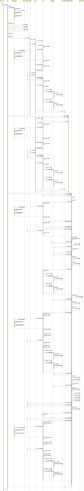
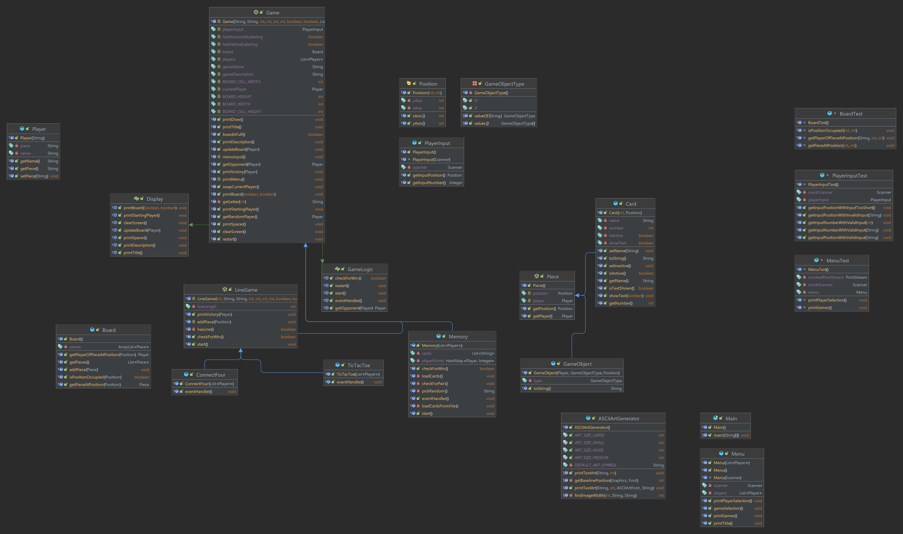

# GameCenter 

Projektarbeit für das Modul M320 des BBZW. Dieses Projekt ist eine Art "Arcade" von momentan 3 Spielen.

- Memory
- VierGewinnt
- TicTacToe

Das ganze wurde so programmiert, das man leicht neue Spiele hinzufügen kann. Die Applikation läuft in der Konsole und verwendet als Buildtool Maven mit der einzigen Dependency "commons-lang-3" (und natürlich die Dependencies fürs testing) von Apache.


```bash
  Verwendet Java19
```


## Verwendete Utils

Es wurde ein ASCII Art Generator von quickprogrammingtips verwendet.
 - [ASCII-ART-GENERATOR-LIBRARY](https://www.quickprogrammingtips.com/java/ascii-art-generator-library-in-java.html)
 


## Authorsl

- [@yanick](https://www.github.com/powershooter83)

Die Grafiken sind auch im resource folder untergebracht.

